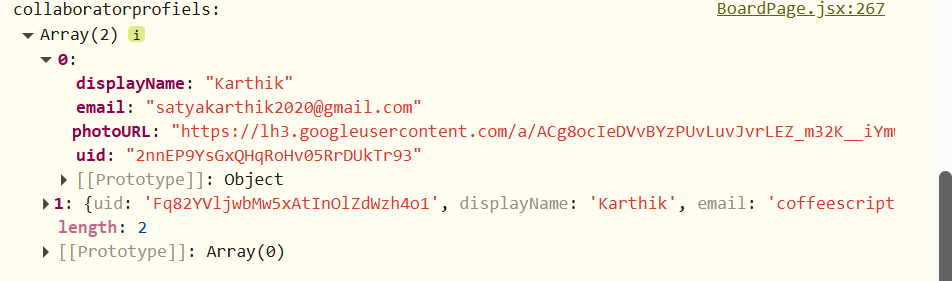
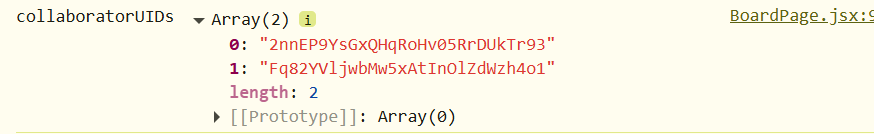
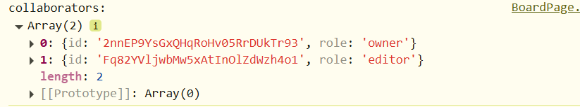

collaboratorprofiles uses --> collaboratorUIDs;
        |  contain email, photoUrl etc everythingg
        |
        

collaboatoruids are set thru --> fetching 'collaborators' subcollection;;
        | contain only uids.
        |
        

collaborators are set thru --> same as above but differnet parameters in it![alt text]
        |  contain uid and the role:owner/editor
        |
        
